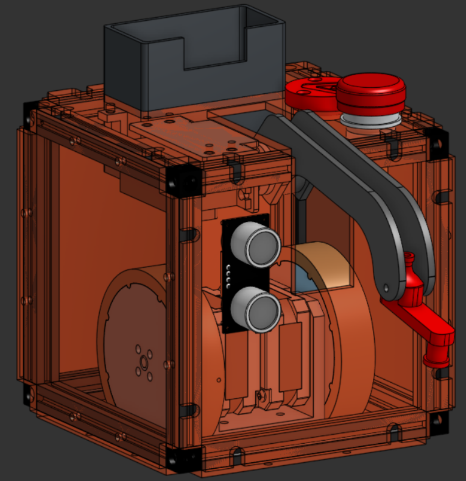

# Partie mécanique du PAMI Ninja

Le PAMI Ninja est constitué de deux sous-ensembles mécaniques principaux. Le premier est une base roulante assurant le déplacement du robot et l’intégration des composants nécessaires à son fonctionnement. Le second correspond aux actionneurs, qui permettent d’interagir avec les éléments présents dans le grenier. Une description détaillée de ces deux parties est accessible via le menu déroulant situé à gauche.

Voici à quoi ressemble le PAMI Ninja dans son ensemble:

