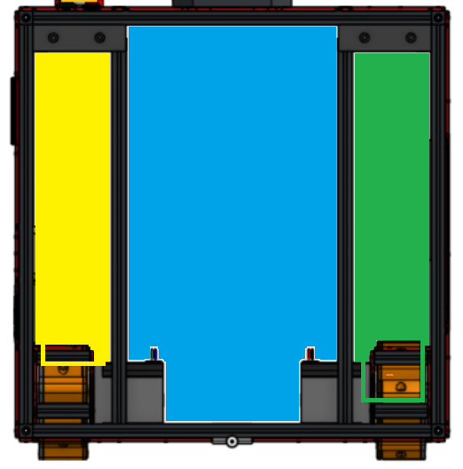
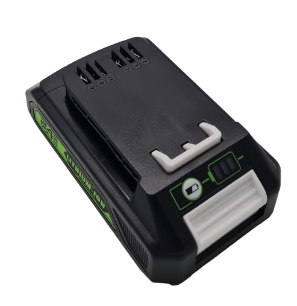
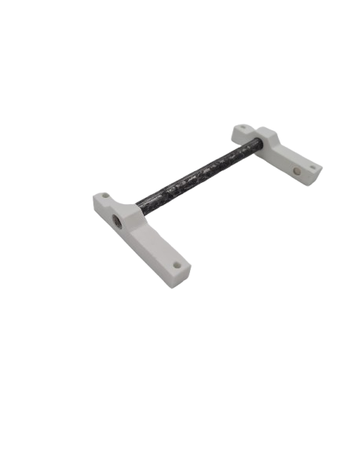
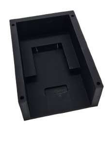
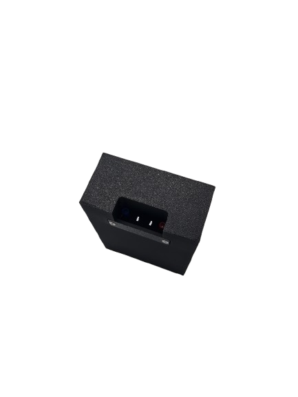

## Le châssis 🧰

### La Base 🛠️
Pour la base du robot, nous avons opté pour un châssis différentiel, c'est à dire un châssis à deux roues motrices. Ce type de châssis est plus simple à mettre en œuvre et plus facile de prise en main, aussi bien pour nous que pour les étudiants de première année car il offre une excellente maniabilité, notamment pour réaliser des rotations sur place et des déplacements précis sans nécessiter une mécannique complexe.

### La Compartimentation 🧩
La structure extérieur du châssis étant complétée, nous avons choisi de le compartiementer en plusieurs espaces distincts :

#### Compartiments 📦 :

- 
- 
- 

## La batterie 🔋

### Choix de la batterie ⚡
Nous avions d’abord prévu d’utiliser des cellules Lithium Fer Phosphate (LiFePO4) en pack maison, car elles sont réputées stables. Malheureusement, les cellules que nous avions en stock se sont révélées en très mauvais état : plusieurs étaient mortes, d’autres fortement gonflées, et l’ensemble présentait des risques réels. De plus, ces batterie demande de l'entretient pour rester stable et efficace.

Face à ces soucis, nous avons abandonné complètement l’idée d'une batterie LiFePO4 brut. Nous avons opté pour une batterie Greenworks 24 V 3.5 Ah. Ce choix s’est imposé pour plusieurs raisons : la tension de 24 V convient parfaitement pour alimenter efficacement nos deux moteurs stepper, la batterie est déjà sécurisé d’origine et il ne demande quasiment aucun entretien.
De plus greenwork est l'une des seules marques à faire des batterie 24V dans le format pour des perceuses/visseuses électriques. Pour comparer les batteries Makita; DeWalt et Boch travaillent majoritairement en 18V.
C’est un compromis pragmatique, économique et fiable.
 

 
Batterie Greenworks 24V (3.5 Ah) 

### Le support de batterie 🔧
La batterie, étant déjà conditionnée, nécessite un support pour être correctement maintenue et connectée à la carte électronique du robot.

Le support a été conçu en prenant comme référence le chargeur de la batterie afin d'assurer un alignement précis. Un rail guide les ports de connexion, tandis qu’une cale rétractable se bloque dans une encoche prévue à cet effet. Cette conception garantit que la batterie reste solidement en place, même si le robot est retourné, et qu’elle ne peut être retirée que lorsque la cale est rétractée.

Enfin, un système de pivotement d’environ 45° a été ajouté afin de permettre l’insertion de la batterie à la verticale et son extraction en biais, rendant la manipulation plus simple et ergonomique.
La batterie est également maintenue en position grâce à des aimants, fixés sur des supports latéraux venant se fixer directement sur les profils MakerBeam du robot. Ce dispositif assure une tenue fiable tout en facilitant la mise en place et le retrait de la batterie.
 

 

### Connecteur de la batterie 🔌
La batterie Greenworks utilise un connecteur propriétaire qui n’est pas facilement remplaçable par des contacts standards. Nous avons cherché des lamelles à lame ressort compatibles, mais aucune solution fiable, robuste et disponible rapidement n’a été trouvée sur le marché.

Nous avons donc utilisé des cosses électriques plates fixées directement sur le compartiment batterie. Cette solution fonctionne techniquement : la connexion tient bien en fonctionnement normal. Cependant, elle présente deux inconvénients pratiques importants : il faut maintenir les cosses à la main lors de l’insertion de la batterie, et il faut aussi les guider / maintenir lors du retrait. Cela rend l’opération peu rapide et pas très ergonomique. De ce faites le support de batterie intègre un système de maintient des cosses électriques en place. 
 

➡️

 
## Les actionneurs 

❌ **La suite de cette documentation n'est pas à jour.**

### Les planches

L'actionneur chargé de soulever les planches avait été imaginé avec des ventouses. Celles-ci, accrochées par paires à l'extrémité de deux bras articulés, étaient reliées à des pompes sur la face arrière du robot. 

### Les conserves

Pour les boites de conserve, l'action se faisait en se basant sur le magnétisme de celles-ci. Incrémentée de petits aimants permanents, la sorte de pince se déplace de haut en bas sur un rail pour soulever les éléments de jeux. 
Pour avoir une idée du processus de conception de cet actionneur, vous retrouverez ci-dessous l'image de la première version : 

On retrouve dès le départ l'idée d'utiliser le magnétisme. Cependant, ce fonctionnement des servomoteurs en direct posait problème.

En effet, l'actionneur arrière n'est pensé que pour une planche ; la seconde devait être portée par l'actionneur conserve. Nous avons par conséquent décidé de déplacer les servos à l'arrière pour arriver au rendu final suivant :

Ce modèle beaucoup plus abouti permet une utilisation fiable des aimants et une mise en place simple de la stratégie permettant de réaliser sans difficultés des gradins de niveaux 1 et 2, et est théoriquement suffisamment puissant pour venir construire un gradin de niveau 3, même si cela n'a jamais réussi en match.

### La banderole

La banderole est le dernier actionneur réalisé ; celle-ci a été pensée pour être positionnée sur l'actionneur conserve.

Déposer en début de match sur la bordure un élastique assure une tension suffisante au bon déploiement de la banderole.

___

## La détéction

Équipé d'un lidar situé au sommet du robot, celui-ci nous offre une détection à 360 degrés ainsi qu'un retour sur l'angle et la distance nous permettant de réagir rapidement lorsqu'un adversaire s'approche trop.

