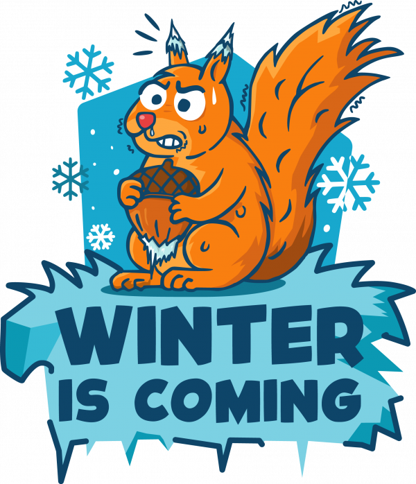
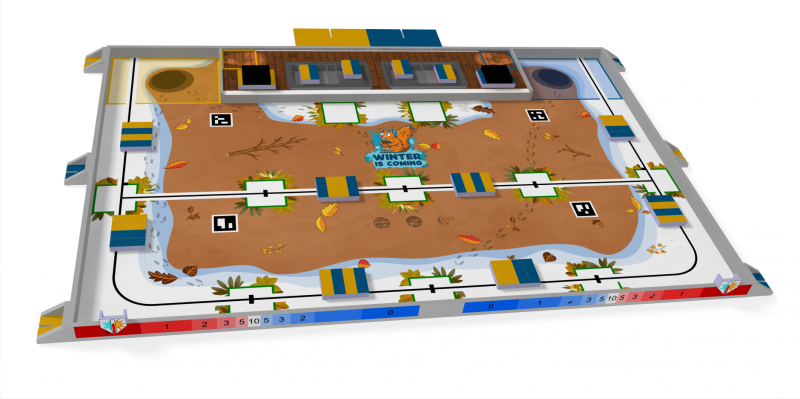
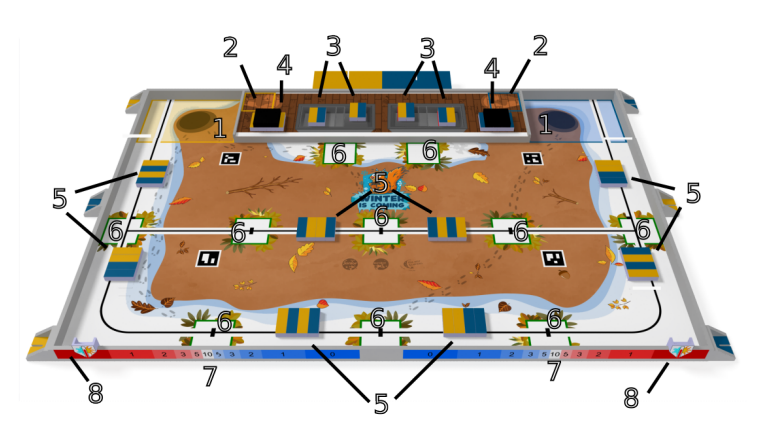
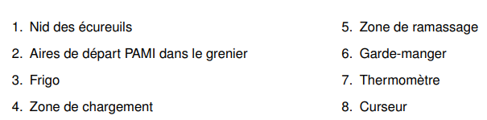

# La Coupe de France de Robotique

## Un événement unique
La **Coupe de France de Robotique** (souvent abrégée **CDFR**) est **le plus grand événement de robotique amateur en Europe**, organisé chaque année par **Planète Sciences** avec le soutien de nombreux partenaires et bénévoles.

Pour l’édition **2026**, la Coupe s’est déroulée du **13 au 16 mai 2026** au **Parc Expo Les Oudairies à La Roche-sur-Yon** (France).

Cette manifestation regroupe **plusieurs compétitions**, dont :
- La **Coupe de France de Robotique Senior**, où des équipes passionnées (étudiants, clubs, makers, etc.) présentent leurs robots autonomes,  
- L’épreuve **Eurobot**, volet international de la compétition,  
- Et la **Coupe de France de Robotique Junior**, destinée aux jeunes dès 7 ans.

Chaque robot doit être **entièrement autonome** et capable de réaliser une série de missions sur une surface de jeu définie dans le règlement autour d’un **thème annuel**, ici **“Winter is Coming”** — symbolisant la préparation de réserves pour l’hiver (écureuils, noisettes, collecte de ressources, etc.).

Les compétitions durent généralement **100 secondes**, et les robots marquent des points en accomplissant des objectifs techniques précis.
Chaque année, la table de jeu et les obstacles changent, demandant aux équipes d’innover et de s’adapter. Par exemple, en 2026 des éléments symboliques comme des **planches jaune et bleu**, un **nid**, un **grenier** et une petite **scène** ont été intégrés au terrain pour représenter différentes **zones de réserves**. *(Voir la documentation officielle)*

## Une opportunité d'apprendre

### En s'amusant 

La compétition est **ouverte à tous** — étudiants, clubs scientifiques, associations ou passionnés de technologie. Elle permet de travailler concrètement sur un **projet complet** mêlant **mécanique, électronique, informatique** et **stratégie**. 

Au-delà de la performance technique, c’est aussi un lieu d’**échanges, de rencontres et de partage**, où les équipes peuvent découvrir d’autres projets, apprendre de nouvelles approches et vivre une **aventure humaine** forte.

### Et en se cassant la tête 

Participer à la Coupe de France de robotique permet de relever un vrai défi, de progresser dans de nombreux domaines et de vivre une expérience unique.

Pour bien comprendre l'envergure du challenge, il faut se pencher plus en détail sur les règles.

Eurobot 2026 impose un cadre technique, stratégique et logistique exigeant.

Chaque équipe doit concevoir un robot totalement autonome capable d’interagir avec des éléments du terrain dans un temps limité. Ses dimensions doivent être inférieures ou égales à 1200 mm en position repliée et inférieures ou égales à 1400 mm en position déployée. Toutes les normes de sécurité de base doivent être respectées, notamment en termes d’électricité.

De plus, un système anti-collision avec les robots adverses est obligatoire et doit être fonctionnel.

Le match, chronométré à 100 secondes, demande d’allier la rapidité et la coordination.

Les actions sont strictement encadrées : déplacement, collecte, positionnement d’objets, le tout sans contact avec l’adversaire comme détaillé ici :

La moindre erreur peut entraîner des pénalités, voire une disqualification. C’est un défi important qui repose sur notre esprit d’équipe et notre ingéniosité.

Ces règles sont à prendre en compte dès le début de notre réflexion, car notre robot doit passer ce que l'on appelle les homologations.

## L'homologation

Avant d’être autorisé à disputer un match, un robot doit être **homologué** par les référés :  
– Une **épreuve statique** pour vérifier les dimensions et la conformité aux règles de sécurité,  
– Une **épreuve dynamique** où le robot doit effectuer au minimum une action significative dans le temps imparti.  

Toute modification après validation doit être **signalée** et peut nécessiter une nouvelle homologation.

Lors de cette édition, "dire si homologation réussi et notre place au classement" de la [CDFR 2026]**.

## L’événement WE R’ TECH’

La Coupe de France de Robotique 2026 s’est intégrée au **festival WE R’ TECH’**, un événement riche mêlant compétition, ateliers, expositions et animations autour des sciences, de la technologie et de la robotique pour **tous les publics**, y compris les enfants.

Ce festival offre également aux visiteurs des **ateliers ludiques et pédagogiques gratuits ou sur inscription**, afin d’**éveiller la curiosité scientifique** des plus jeunes.

## Où et quand ?

**Coupe de France de Robotique 2026**  
📍 Parc Expo Les Oudairies — La Roche-sur-Yon, France  
📅 Du **13 au 16 mai 2026**  
🕘 De 09 h00 à 18 h00 (jours d’exposition)

[UniWIP]: https://github.com/orgs/Unimakers/teams/uniwip  
[CDFR 2026]: https://www.coupederobotique.fr/edition-2026/  
[Just The Docs]: https://just-the-docs.com/  
[Jekyll]: https://jekyllrb.com

